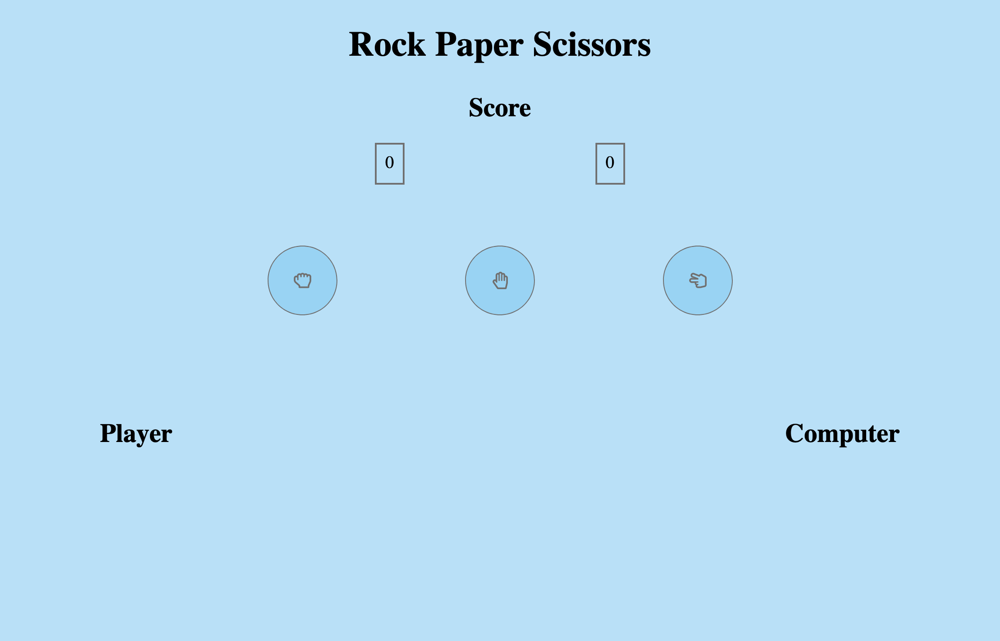

# Rock Paper Scissors by Miguel Lopez

# Objective

A responsive Rock Paper Scissors app, built using javascript and Scss. It takes input through the buttons, which then triggers a function that will randomly select a choice for the computer. Both variables would be stored and then compared inside an If Else statement, and the results are pushed into divs.

# Possible Future Features

- [] Dark/Light mode switch
- [] Overall game rounds
